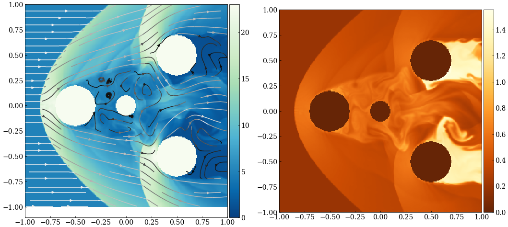
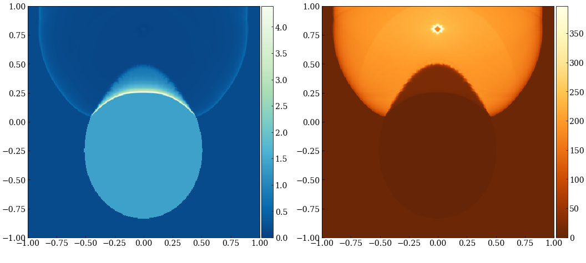
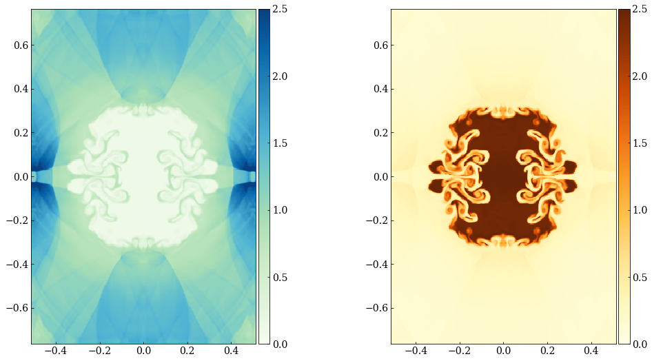

# fluid_pde
Fun filled flowy fluid dynamics partial differential equation solver with 3rd
order accuracy (PPM SSPRK3).

Supersonic wind:




Explosive lens:



Random:



## Usage
Build dependencies: g++ or similar for C++17, make, pthreads

```
cd src
make
./fluid
```

View in a browser while running: `cd viewer && python -m http.server` and
open browser to `http://localhost:8000/` (via
[websocket_ctube](https://github.com/bryance-oyang/websocket_ctube))

In `src/init_cond` make a initial condition file from `template_init_cond.h` and
include in `init_cond.cc`.

Settings in `src/config.h`
